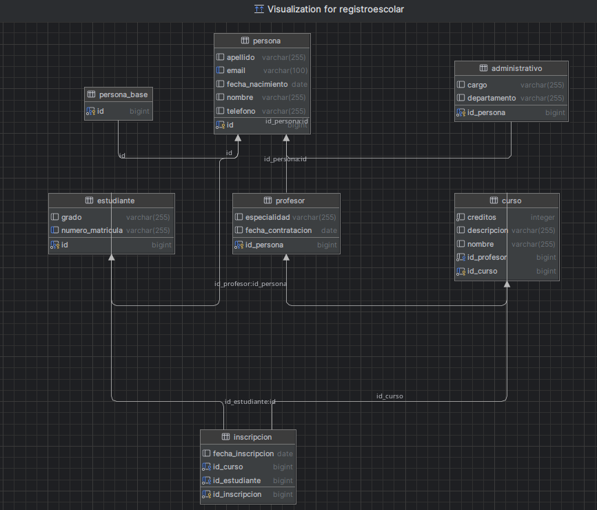

# Registro Escolar - Backend API

Este proyecto es un backend RESTful construido con **Spring Boot**, siguiendo una arquitectura en capas y buenas prácticas. Gestiona entidades como estudiantes, profesores, administrativos, cursos e inscripciones.

---

## Tecnologías

- Java 21
- Spring Boot 3+
- Spring Data JPA
- H2 Database (modo archivo)
- PostgreSQL
- Maven
- ModelMapper
- Swagger / OpenAPI
- Docker + Docker Compose

---

## Estructura del Proyecto

## Modelo de Datos (Esquema)



## Requisitos

- Java 17 o superior
- Maven
- Docker (opcional, para correr con contenedores)
- PostgreSQL (si se desea usar la BD local en lugar de Docker o H2)

---

## Perfiles disponibles

Este proyecto usa perfiles de Spring Boot para cambiar entre entornos:

- `dev`: usa **H2** (base de datos en archivo local)
- `prod`: usa **PostgreSQL** (local o Docker)

---

## OPCIÓN 1: Ejecutar con H2 (perfil `dev`)

Para un desarrollo rápido sin instalar PostgreSQL.

### Configuración

1. Asegúrarse de **NO tener** activada las variables de entorno en IntelliJ.
2. Activa el perfil `dev` en configuración de ejecución (Run Configuration):
    - **VM options**:
      ```
      -Dspring.profiles.active=dev
      ```

### Ejecutar

Simplemente haz clic en **Run** en IntelliJ o:

./mvnw spring-boot:run -Dspring-boot.run.profiles=dev

### Ver la base de datos H2
Abre en el navegador:
http://localhost:8080/h2-console

- JDBC URL: jdbc:h2:file:./data/registroescolar
- User: sa
- Password: (vacío)

### Ver los Endpoints
  http://localhost:8080

  http://localhost:8080/swagger-ui/index.html


# OPCIÓN 2: Ejecutar con PostgreSQL local (perfil prod)
Para entorno similar a producción.

### Configuración
Instala PostgreSQL localmente y crea la BD registroescolar: 

- SPRING_PROFILES_ACTIVE=prod
- SPRING_DATASOURCE_URL=jdbc:postgresql://localhost:5432/registroescolar
- SPRING_DATASOURCE_USERNAME=postgres
- SPRING_DATASOURCE_PASSWORD=123456

NOTA: Asegúrate que los valores coincidan con tu configuración real de PostgreSQL

./mvnw spring-boot:run -Dspring-boot.run.profiles=prod

### Ver los Endpoints
http://localhost:8080

http://localhost:8080/swagger-ui/index.html


# OPCIÓN 3: Ejecutar con Docker + PostgreSQL
Usa contenedores para que depender del sistema.

### Requisitos
Tener Docker y Docker Compose instalados.

Ya configurado el archivo docker-compose.yml y Dockerfile.

### Ejecutar todo con Docker

docker compose up --build

- El anterior comando nos permite construir el backend Java. 
- Crea y ejecuta un contenedor PostgreSQL con datos persistentes.
- Usa automáticamente el perfil prod.

### Ver los enpoind

En el navegaro visitar

http://localhost:8080

http://localhost:8080/swagger-ui/index.html
```bash
